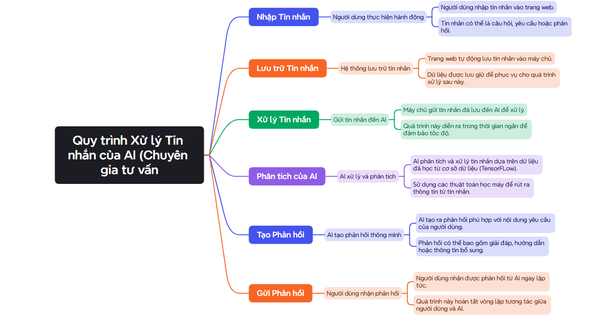

# Plantiq8a1 - EDS_Trh_8A1

## Introduction
Plantiq8a1 is an AI-powered web application designed to assist users in plant care. This project aims to make plant analysis and care easier by leveraging modern AI technology, including OpenAI and Gemini models. The application provides two core functionalities:
1. **AI Consultant** - Users can interact with an AI chatbot that provides expert advice on plant care, including watering schedules, pest control, and optimal growth conditions.
2. **AI Image Analysis** - Users can upload images of their plants, and the AI model will analyze their health status, identifying diseases, nutrient deficiencies, and other potential issues with an accuracy rate of 99.9%.

The project is completely **free and open-source**, designed to be accessible to a broad audience, including plant enthusiasts, students, and farmers. The UI/UX is kept simple to ensure ease of use, especially for individuals who are not tech-savvy.

## Key Features
- **AI-powered plant care consultation** - Users can ask questions about plant care and receive instant AI-generated responses.
- **High-accuracy image-based plant diagnosis** - AI can analyze plant health based on uploaded images.
- **Web-based and platform-independent** - No need for installation; works on any modern web browser.
- **Open-source and free to use** - Anyone can contribute to and improve the project.

## Technologies Used
- **Frontend:** HTML, CSS, JavaScript, React.js
- **Backend:** Node.js, Express.js
- **AI Models:** OpenAI, Gemini, Copilot for chatbot, image analysis and search plant data
- **Database:** MongoD (for storing user interactions and plant data)
- **Cloud Storage & Database:** Microsoft Azure
- **infrastructure:** TensorFlow

## Installation & Setup
### Prerequisites
Ensure you have the following installed before proceeding:
- [Node.js](https://nodejs.org/) (for running the web application)
- npm or yarn (for managing dependencies)
- Python 3.x (for AI-related scripts)
- TensorFlow (if running a local database)

### Installation Steps
1. **Clone the repository:**
   ```bash
   git clone <our link>
   cd AI-Trong-Cay
   ```
2. **Install dependencies:**
   ```bash
   npm install
   ```
3. **Set up environment variables:**
   - Create a `.env` file in the root directory.
   - Add the necessary API keys and database connection details.

4. **Start the backend server:**
   ```bash
   cd backend
   node server.js
   ```
5. **Start the frontend application:**
   ```bash
   cd frontend
   npm start
   ```
6. **Access the application:**
   Open a web browser and go to `http://localhost:3000`.

## database & Cloud AI
```
Grok_Information_Infrastructure_for_Agriculture
├── 1️⃣ User Interaction (Frontend)
│   ├── Web (React.js, Next.js)
│   │     ├── Giao diện tìm kiếm thông tin cây cối
│   │     ├── Giao diện upload ảnh cây (base64) và hiển thị kết quả chẩn đoán
│   │     ├── Dashboard theo dõi lịch sử truy vấn và khuyến nghị chăm sóc
│   │     └── Tích hợp biểu đồ, báo cáo hiệu suất của cây trồng
│   ├── Chat Interface & Messaging
│   │     ├── Hỗ trợ trao đổi tin nhắn thời gian thực giữa người dùng và hệ thống
│   │     ├── Giao diện chat văn bản cho các truy vấn liên quan đến chăm sóc, bệnh lý và lịch tưới tiêu của cây
│   │     └── Tích hợp AI chatbot với khả năng trả lời chuyên sâu dựa trên dữ liệu chuyên ngành nông nghiệp
│   └── API Requests
│         ├── Endpoint RESTful cho việc upload dữ liệu (ảnh, tin nhắn)
│         └── Hỗ trợ các phương thức GET, POST, PUT, DELETE cho dữ liệu người dùng
│
├── 2️⃣ Backend (Node.js + Express)
│   ├── server.js
│   │     ├── Điều phối và phân luồng các request đến các module xử lý khác
│   │     ├── Tích hợp với API Gateway để phân phối tải và cân bằng hệ thống
│   │     └── Cung cấp logging chi tiết cho mỗi request
│   ├── auth.js
│   │     ├── Xác thực người dùng bằng JWT, OAuth2
│   │     ├── Quản lý phiên làm việc và cấp phát token
│   │     └── Kiểm tra quyền truy cập và phân quyền người dùng theo vai trò
│   ├── grokController.js
│   │     ├── Gửi và nhận yêu cầu tới Grok API để tìm kiếm thông tin chuyên sâu
│   │     ├── Điều phối các truy vấn đến module NLP và hệ thống chuyên gia
│   │     └── Kết nối các kết quả từ cơ sở tri thức chuyên ngành nông nghiệp
│   ├── imageController.js
│   │     ├── Tiếp nhận ảnh cây cối mã hóa base64 từ người dùng
│   │     ├── Gọi OpenAI Image Analysis Connector để xử lý ảnh
│   │     └── Trả về kết quả chẩn đoán, khuyến nghị chăm sóc và báo cáo tình trạng cây
│   ├── messageController.js
│   │     ├── Xử lý tin nhắn đầu vào và phân tích nội dung qua Gemini Messaging API Connector
│   │     ├── Định hướng truy vấn về các chủ đề chuyên sâu: chăm sóc, bệnh lý, lịch tưới nước, dinh dưỡng,...
│   │     └── Tạo ra phản hồi tự động dựa trên dữ liệu từ Grok và cơ sở tri thức chuyên ngành
│   ├── errorHandler.js
│   │     ├── Ghi nhận lỗi và cảnh báo từ toàn hệ thống
│   │     ├── Phân tích lỗi theo mức độ nghiêm trọng để đưa ra phản hồi kịp thời
│   │     └── Tích hợp hệ thống báo cáo tự động cho quản trị viên
│   └── apiGateway.js
│         ├── Điều phối các request giữa backend nội bộ và các API bên ngoài
│         ├── Cân bằng tải và định tuyến thông minh theo trạng thái hệ thống
│         └── Cung cấp API logging và phân tích hiệu suất
│
├── 3️⃣ Information Processing Engine
│   ├── Grok Search & Classification Module
│   │     ├── NLP Preprocessing
│   │     │     ├── Tokenization, Stemming, Lemmatization cho truy vấn về cây cối
│   │     │     ├── Loại bỏ stop words và chuẩn hóa dữ liệu văn bản
│   │     │     └── Phân tích ngữ cảnh để hiểu ý định người dùng (ví dụ: “cây bị vàng lá”, “cây không ra hoa”)
│   │     ├── Semantic Search Engine
│   │     │     ├── Tìm kiếm theo ngữ nghĩa trong cơ sở dữ liệu nội bộ và các nguồn mở từ Internet
│   │     │     ├── Sử dụng embedding vector để so sánh và xếp hạng các kết quả phù hợp
│   │     │     └── Tích hợp với hệ thống tri thức chuyên ngành nông nghiệp
│   │     ├── Information Filtering
│   │     │     ├── Loại bỏ thông tin lỗi thời, sai lệch hoặc không liên quan
│   │     │     ├── Áp dụng các thuật toán kiểm chứng dữ liệu dựa trên nguồn tin cậy
│   │     │     └── Sử dụng Expert Validation Module so sánh với dữ liệu chuyên gia
│   │     └── Expert Validation Module
│   │           ├── Kết nối với cơ sở tri thức của các chuyên gia nông nghiệp
│   │           ├── Xác minh độ tin cậy của kết quả tìm kiếm
│   │           └── Đánh giá thông tin dựa trên các tiêu chí chuyên môn (độ ẩm đất, dinh dưỡng, bệnh tật, thời tiết,…)
│   │
│   ├── AI Reasoning & Self-Correction Module
│   │     ├── Inference Engine
│   │     │     ├── Áp dụng các thuật toán suy luận (logic fuzzy, rule-based) để phân tích dữ liệu cây trồng
│   │     │     ├── Đưa ra các giả thuyết và khuyến nghị dựa trên dữ liệu lịch sử và hiện tại
│   │     │     └── Tích hợp với mô hình TensorFlow để tăng cường khả năng dự đoán
│   │     ├── Self-Correction Algorithm
│   │     │     ├── Tự động nhận diện và sửa lỗi thông tin dựa trên phản hồi từ người dùng và chuyên gia
│   │     │     ├── Áp dụng kỹ thuật reinforcement learning để điều chỉnh các tham số dự đoán
│   │     │     └── Cập nhật mô hình theo thời gian thực dựa trên các trường hợp ngoại lệ
│   │     └── Feedback Loop Integration
│   │           ├── Thu thập phản hồi từ người dùng sau mỗi lần tương tác
│   │           ├── Phân tích hiệu suất của các khuyến nghị và kết quả chẩn đoán
│   │           └── Điều chỉnh hệ thống dựa trên các chỉ số hiệu suất và phản hồi chất lượng
│   │
│   ├── AI Hybridization Module
│   │     ├── OpenAI Image Analysis Connector
│   │     │     ├── Base64 Image Ingestion & Preprocessing
│   │     │     │     ├── Giải mã ảnh base64, chuyển đổi định dạng và chuẩn hóa kích thước ảnh
│   │     │     │     ├── Sử dụng các kỹ thuật augmentation (rotate, flip, zoom,…) để tăng cường dữ liệu
│   │     │     │     └── Trích xuất đặc trưng thông qua các lớp convolutional của deep neural network
│   │     │     ├── Plant Disease Diagnosis & Growth Assessment
│   │     │     │     ├── Phát hiện các dấu hiệu bệnh lý, nhiễm khuẩn, sâu bệnh và thiếu hụt dinh dưỡng
│   │     │     │     ├── Phân loại các loại bệnh dựa trên dữ liệu hình ảnh đã được huấn luyện
│   │     │     │     └── Đánh giá mức độ tăng trưởng, sức khỏe và năng suất của cây
│   │     │     └── Recommendation Engine
│   │     │           ├── Đưa ra các khuyến nghị chăm sóc: bón phân, tưới nước, xử lý bệnh theo từng giai đoạn
│   │     │           ├── Xây dựng kế hoạch chăm sóc cây dựa trên chu kỳ sinh trưởng, thời tiết và đặc điểm cây trồng
│   │     │           └── Tích hợp dữ liệu từ cơ sở tri thức chuyên ngành nông nghiệp (ví dụ: tài liệu, báo cáo nghiên cứu)
│   │     ├── Gemini Messaging API Connector
│   │     │     ├── Text Preprocessing & Semantic Analysis
│   │     │     │     ├── Làm sạch và chuẩn hóa tin nhắn của người dùng
│   │     │     │     ├── Áp dụng phân tích ngữ nghĩa để xác định ý định (ví dụ: “cây có dấu hiệu bệnh”, “tư vấn cách tưới nước”)
│   │     │     │     └── Phân loại tin nhắn theo các chủ đề: chăm sóc, bệnh lý, tưới tiêu, dinh dưỡng, thời tiết
│   │     │     ├── Contextual Analysis & Historical Matching
│   │     │     │     ├── So sánh tin nhắn với dữ liệu lịch sử và các trường hợp tương tự trong cơ sở tri thức
│   │     │     │     └── Xác định ngữ cảnh cụ thể dựa trên vị trí, mùa vụ và loại cây
│   │     │     └── Intelligent Reply Generator
│   │     │           ├── Tạo phản hồi tự động dựa trên kết quả phân tích tin nhắn và dữ liệu chuyên gia được tích hợp từ Grok
│   │     │           ├── Tích hợp các phản hồi từ OpenAI và các mô hình TensorFlow để đưa ra phản hồi chính xác
│   │     │           └── Hỗ trợ trả lời đa dạng dạng văn bản, biểu đồ và báo cáo trực quan
│   │     └── TensorFlow Integration Module
│   │           ├── Custom Plant Growth & Health Models
│   │           │     ├── Các mô hình dự đoán tăng trưởng, năng suất và sức khỏe của cây được thiết kế riêng cho từng loại cây và điều kiện môi trường
│   │           │     ├── Huấn luyện mô hình với dữ liệu thực tế từ nông trại và IoT sensors (độ ẩm, nhiệt độ, ánh sáng,…)
│   │           │     └── Tích hợp các dữ liệu huấn luyện dạng TFRecord, HDF5 để tối ưu hóa hiệu suất học máy
│   │           ├── Model Optimization & Retraining
│   │           │     ├── Quy trình huấn luyện lại mô hình định kỳ hoặc theo yêu cầu khi có dữ liệu mới
│   │           │     ├── Thực hiện A/B testing giữa các phiên bản mô hình để đánh giá hiệu suất
│   │           │     └── Sử dụng kỹ thuật transfer learning nhằm rút ngắn thời gian huấn luyện và cải thiện độ chính xác
│   │           └── Data Augmentation Strategies
│   │                 ├── Tăng cường dữ liệu hình ảnh qua các phương pháp kỹ thuật số (rotate, flip, color jitter,…)
│   │                 └── Tạo ra các mẫu dữ liệu tổng hợp từ các nguồn khác nhau để đa dạng hóa tập huấn luyện
│
├── 4️⃣ Data Storage & Logging
│   ├── Database Systems (Google TensorFlow)
│   │     ├── Relational Storage với TFRecord & HDF5
│   │     │     ├── Lưu trữ dữ liệu ảnh, kết quả phân tích và phản hồi dưới dạng tập tin nhị phân tối ưu cho học máy
│   │     │     └── Hỗ trợ truy xuất và xử lý dữ liệu lớn phục vụ cho việc huấn luyện và dự đoán mô hình AI
│   │     └── Không sử dụng MongoDB (Toàn bộ lưu trữ được tích hợp trên hạ tầng TensorFlow của Google)
│   ├── Logs & Monitoring
│   │     ├── System Logs
│   │     │     ├── Ghi nhận tất cả các sự kiện, giao dịch và lỗi của hệ thống
│   │     │     └── Hỗ trợ phân tích theo thời gian thực để phát hiện và xử lý sự cố
│   │     ├── Performance Metrics
│   │     │     ├── Theo dõi hiệu suất hoạt động của từng module (độ trễ API, tốc độ xử lý ảnh, thời gian phản hồi,…)
│   │     │     └── Cung cấp dashboard hiển thị các chỉ số quan trọng và cảnh báo khi vượt ngưỡng quy định
│   │     └── Security Auditing
│   │           ├── Ghi nhận các hoạt động đăng nhập, truy cập và thao tác dữ liệu nhạy cảm
│   │           └── Thực hiện kiểm tra bảo mật định kỳ để phát hiện xâm nhập hoặc hoạt động đáng ngờ
│
├── 5️⃣ AI Knowledge Base & Continuous Learning Pipeline
│   ├── Knowledge Extraction & Update Module
│   │     ├── Expert Systems Integration
│   │     │     ├── Kết nối với cơ sở dữ liệu chuyên gia nông nghiệp, viện nghiên cứu và các tạp chí chuyên ngành
│   │     │     ├── Tích hợp với hệ thống Knowledge Graphs và Semantic Networks để liên kết các khái niệm
│   │     │     └── Cập nhật thông tin qua API từ các nguồn uy tín và báo cáo nghiên cứu
│   │     ├── Data Mining & Web Crawling
│   │     │     ├── Thu thập dữ liệu mới từ các website, diễn đàn và tạp chí khoa học liên quan đến nông nghiệp
│   │     │     └── Phân tích dữ liệu thu thập được để xác định xu hướng và thông tin chuyên sâu
│   │     └── Ontology & Semantic Networks
│   │           ├── Xây dựng hệ thống từ vựng chuyên ngành, liên kết các khái niệm về cây trồng, bệnh tật và kỹ thuật chăm sóc
│   │           └── Tích hợp với các hệ thống AI để cải thiện khả năng phân tích ngữ nghĩa và trả lời truy vấn
│   │
│   ├── Data Cleaning, Validation & Enrichment Module
│   │     ├── Automated Data Cleaning
│   │     │     ├── Sử dụng các thuật toán machine learning để tự động phát hiện, loại bỏ dữ liệu nhiễu và sửa lỗi
│   │     │     └── Áp dụng các quy tắc loại bỏ dữ liệu trùng lặp, sai sót và thông tin lỗi thời
│   │     ├── Validation Rules & Cross-Checking
│   │     │     ├── So sánh dữ liệu mới với các nguồn đáng tin cậy để đảm bảo tính chính xác
│   │     │     └── Áp dụng các thuật toán so sánh dữ liệu giữa các nguồn khác nhau
│   │     └── Data Enrichment
│   │           ├── Bổ sung thông tin phụ trợ từ các API bên ngoài (thời tiết, dữ liệu IoT, dữ liệu địa lý,…)
│   │           └── Kết hợp dữ liệu văn bản với dữ liệu số để tạo ra một tập dữ liệu toàn diện cho việc huấn luyện mô hình AI
│   │
│   ├── Continuous Learning & Model Retraining Pipeline
│   │     ├── Incremental Learning
│   │     │     ├── Huấn luyện lại mô hình dựa trên luồng dữ liệu mới mà không gây gián đoạn hệ thống
│   │     │     └── Áp dụng kỹ thuật online learning để cập nhật dự đoán theo thời gian thực
│   │     ├── A/B Testing & Performance Evaluation
│   │     │     ├── Thử nghiệm các phiên bản mô hình khác nhau trên tập dữ liệu kiểm thử
│   │     │     └── Đánh giá hiệu suất qua các chỉ số như độ chính xác, recall, precision và F1 score
│   │     └── Auto-Deployment & Versioning
│   │           ├── Tự động cập nhật phiên bản mới của mô hình sau khi hoàn tất kiểm thử
│   │           ├── Quản lý phiên bản mô hình và rollback nếu cần thiết
│   │           └── Đảm bảo đồng bộ giữa backend, API và hệ thống học liên tục
│
├── 6️⃣ Security, Privacy & Optimization
│   ├── Secure Communication Protocols
│   │     ├── HTTPS, TLS Encryption cho mọi kết nối giữa client và server
│   │     ├── Sử dụng JWT, OAuth2 cho việc xác thực và ủy quyền truy cập
│   │     └── Mã hóa dữ liệu nhạy cảm khi lưu trữ trên hệ thống TensorFlow
│   ├── Rate Limiting & Abuse Prevention
│   │     ├── API Rate Limiting dựa trên IP và token người dùng
│   │     ├── Phát hiện và chặn bot, các truy cập đáng ngờ thông qua giải pháp machine learning
│   │     └── Áp dụng các hệ thống bảo mật tích hợp (WAF, DDoS protection) để bảo vệ hệ thống
│   ├── Auto-Deployment, Containerization & Orchestration
│   │     ├── CI/CD Pipelines (GitHub Actions, Jenkins) để tự động build, test và deploy các phiên bản mới
│   │     ├── Docker Containers cho việc đóng gói các thành phần ứng dụng
│   │     └── Kubernetes Cluster để quản lý tài nguyên, cân bằng tải và tự phục hồi khi có lỗi
│   └── AI Self-Learning & Adaptive Optimization
│         ├── Real-Time Monitoring & Feedback Analysis
│         │     ├── Giám sát liên tục các chỉ số hệ thống (CPU, Memory, latency,…) và phản hồi người dùng
│         │     └── Cập nhật tham số mô hình dựa trên dữ liệu thời gian thực
│         ├── Anomaly Detection & Recovery
│         │     ├── Sử dụng AI để phát hiện sớm các dấu hiệu bất thường trong dữ liệu và hệ thống
│         │     └── Tự động kích hoạt các biện pháp khắc phục khi phát hiện lỗi
│         └── Adaptive Resource Allocation
│               ├── Tối ưu hóa phân bổ tài nguyên theo nhu cầu sử dụng (auto-scaling)
│               └── Điều chỉnh các tham số hoạt động dựa trên phân tích hiệu suất và tải hệ thống
│
└── 7️⃣ External API Integrations & Ecosystem
      ├── OpenAI API – Expert Image Analysis for Plants
      │     ├── Base64 Image Ingestion & Preprocessing
      │     │     ├── Nhận dữ liệu ảnh mã hóa base64, giải mã và chuyển đổi định dạng phù hợp cho mô hình deep learning
      │     │     ├── Chuẩn hóa kích thước, chất lượng và áp dụng các kỹ thuật augmentation
      │     │     └── Trích xuất đặc trưng thông qua các lớp convolutional của deep neural network
      │     ├── Plant Disease Diagnosis & Growth Assessment
      │     │     ├── Phát hiện sớm các dấu hiệu bệnh lý, nhiễm khuẩn, sâu bệnh và thiếu hụt dinh dưỡng
      │     │     ├── Phân loại và đánh giá mức độ tăng trưởng, sức khỏe và năng suất của cây dựa trên dữ liệu hình ảnh
      │     │     └── So sánh kết quả với dữ liệu chuyên ngành được tích hợp từ Grok Knowledge Base
      │     └── Recommendation Engine
      │           ├── Đưa ra các khuyến nghị chăm sóc: bón phân, tưới nước, xử lý bệnh, cắt tỉa,...
      │           ├── Xây dựng kế hoạch chăm sóc cây theo chu kỳ sinh trưởng, thời tiết và đặc điểm cây trồng
      │           └── Tích hợp phản hồi từ chuyên gia và dữ liệu thời gian thực từ IoT sensors (nếu có)
      │
      ├── Gemini API – Intelligent Messaging & Query Analysis
      │     ├── Natural Language Understanding (NLU)
      │     │     ├── Phân tích và hiểu ý định từ tin nhắn người dùng liên quan đến cây trồng
      │     │     ├── Tách từ, nhận diện entity và phân loại ngữ cảnh truy vấn
      │     │     └── Xác định các chủ đề như chăm sóc, bệnh tật, tưới tiêu, dinh dưỡng và thời tiết
      │     ├── Contextual Reply Generation
      │     │     ├── So sánh tin nhắn với dữ liệu lịch sử và các trường hợp tương tự
      │     │     └── Tạo phản hồi dựa trên ngữ cảnh và dữ liệu chuyên gia được tích hợp từ Grok
      │     └── Multi-Modal Data Support
      │           ├── Xử lý tin nhắn chứa văn bản và các meta-data liên quan
      │           └── Hỗ trợ trả lời đa dạng dạng văn bản, biểu đồ và báo cáo trực quan
      │
      ├── Additional Integrations (Optional)
      │     ├── Weather API Integration
      │     │     ├── Cập nhật dữ liệu thời tiết theo khu vực (nhiệt độ, độ ẩm, lượng mưa,…)
      │     │     └── Liên kết dữ liệu thời tiết với thông tin cây trồng để đưa ra khuyến nghị chăm sóc kịp thời
      │     ├── IoT Sensors Data Aggregation
      │     │     ├── Kết nối với các cảm biến môi trường trong nông trại (độ ẩm đất, ánh sáng, nhiệt độ,…)
      │     │     └── Thu thập dữ liệu thời gian thực, tích hợp với hệ thống dự báo và giám sát sức khỏe cây trồng
      │     └── External Research & Agricultural Data Sources
      │           ├── Liên kết với các cơ sở dữ liệu nghiên cứu, báo cáo khoa học và tạp chí chuyên ngành
      │           └── Cập nhật thông tin mới nhất về kỹ thuật canh tác, phát hiện bệnh và cải tiến công nghệ nông nghiệp

```

## How It Works

📌 **Consultant (AI)**:​




📸 **Image Analysis Expert (AI)**:​


## Contributing
We welcome contributions from developers, AI enthusiasts, and plant lovers! You can contribute by:
- Fixing bugs or optimizing code.
- Adding new plant species to the AI model.
- Improving the chatbot's knowledge base.
- Enhancing UI/UX for better usability.

### How to Contribute
1. Fork the repository.
2. Create a new branch for your feature.
3. Commit your changes and push them to your fork.
4. Submit a pull request.

## License
This project is licensed under the MIT License, meaning it is free to use, modify, and distribute.

## Contact
For inquiries, support, or collaboration, please reach out via:
- Email: [notmerblx2123@gmail.com]
- team:
+ Nguyen Thanh Tung
+ Nguyen Binh Minh
+ Le Khanh Hung
+ Nguyen Hoang Duy
+ Pham Nguyen Tuan Minh
+ Do Xuan Bao Ninh

---
We hope Plantiq8a1 helps you take better care of your plants! 🌱🚀

#AIFORGOOD2025 (VN)

